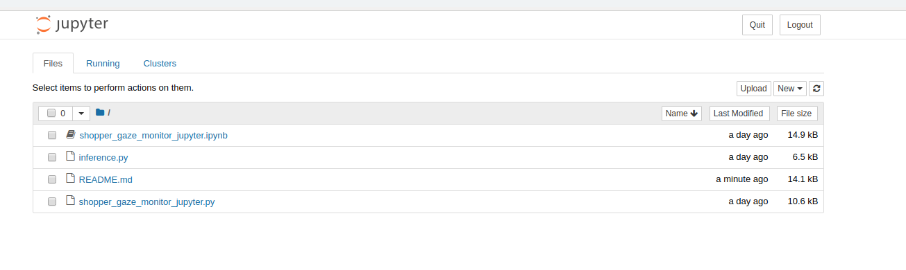
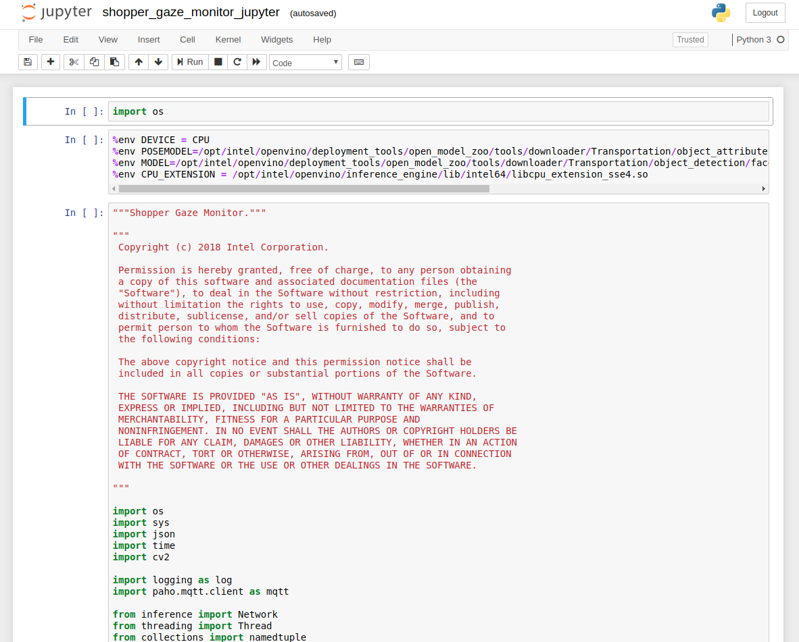

# Shopper Gaze Monitor

| Details               |              |
|-----------------------|---------------|
| Target OS:            |  Ubuntu\* 16.04 LTS   |
| Programming Language: |  Python* 3.5 |
| Time to Complete:     |  30 min     |

<!--
This reference implementation is also [available in C++](https://github.com/intel-iot-devkit/reference-implementation-private/blob/master/shopper-gaze-monitor/README.md).
-->


## What it does

This shopper gaze monitor application is designed for a retail shelf mounted camera system that counts the number of passers-by and the number of people who look towards the display. It is intended to provide real-world marketing statistics for in-store shelf-space advertising.

## Requirements
### Hardware

* 6th to 8th generation Intel® Core™ processor with Iris® Pro graphics or Intel® HD Graphics

### Software

* Ubuntu 16.04

* OpenCL™ Runtime Package

  **Note:** We recommend using a 4.14+ kernel to use this software. Run the following command to determine your kernel version:

      uname -a
  
* Intel® Distribution of OpenVINO™ toolkit 2019 R2 Release
* Jupyter* Notebook v5.7.0

## How It works

The application uses the Inference Engine included in the Intel Distribution of OpenVINO toolkit and the Intel Deep Learning Deployment Toolkit. It uses a video source, such as a camera, to grab frames and then uses two different Deep Neural Networks (DNNs) to process the data. The first network looks for faces and then if successful is counted as a "Shopper" 

A second neural network is then used to determine the head pose detection for each detected face. If the person's head is facing towards the camera, it is counted as a "Looker"

The shopper and looker data are sent to a local web server using the Paho* MQTT C client libraries.

The program creates two threads for concurrency:

 * Main thread that performs the video i/o, processes video frames using the trained neural network.
 * Worker thread that publishes MQTT messages.


**Architectural Diagram**

## Setup
### Get the code

Clone the reference implementation:
```
sudo apt-get update && sudo apt-get install git
git clone https://gitlab.devtools.intel.com/reference-implementations/shopper-gaze-monitor-python.git
``` 

### Install Intel® Distribution of OpenVINO™ toolkit

Refer to https://software.intel.com/en-us/articles/OpenVINO-Install-Linux for more information about how to install and setup the Intel® Distribution of OpenVINO™ toolkit.

You will need the OpenCL™ Runtime package if you plan to run inference on the GPU. It is not mandatory for CPU inference. 

### Other dependencies
#### Mosquitto*
Mosquitto is an open source message broker that implements the MQTT protocol. The MQTT protocol provides a lightweight method of carrying out messaging using a publish/subscribe model.

### Which model to use

This application uses the [face-detection-adas-0001](https://docs.openvinotoolkit.org/2019_R2/_intel_models_face_detection_adas_0001_description_face_detection_adas_0001.html) and [head-pose-estimation-adas-0001](https://docs.openvinotoolkit.org/2019_R2/_intel_models_head_pose_estimation_adas_0001_description_head_pose_estimation_adas_0001.html) Intel® model, that can be downloaded using the **model downloader**. The **model downloader** downloads the __.xml__ and __.bin__ files that is used by the application. 

To install the dependencies of the RI and to download the models Intel® model, run the following command:

    cd <path_to_the_shopper-gaze-monitor-python_directory>
    ./setup.sh 
    
The files will be downloaded inside the following directories:

    /opt/intel/openvino/deployment_tools/open_model_zoo/tools/downloader/Transportation/object_detection/face/pruned_mobilenet_reduced_ssd_shared_weights/dldt/     
    /opt/intel/openvino/deployment_tools/open_model_zoo/tools/downloader/Transportation/object_attributes/headpose/vanilla_cnn/dldt/ 

### The Config File

The _resources/config.json_ contains the path to the videos that will be used by the application.
The _config.json_ file is of the form name/value pair, `video: <path/to/video>`   

Example of the _config.json_ file:

```
{

    "inputs": [
	    {
            "video": "videos/video1.mp4"
        }
    ]
}
```

### Which Input video to use

The application works with any input video. Find sample videos [here](https://github.com/intel-iot-devkit/sample-videos/).  

For first-use, we recommend using the [face-demographics-walking-and-pause](https://github.com/intel-iot-devkit/sample-videos/blob/master/face-demographics-walking-and-pause.mp4) video.The video is automatically downloaded to the `resources/` folder.
For example: <br>
The config.json would be:

```
{

    "inputs": [
	    {
            "video": "sample-videos/face-demographics-walking-and-pause.mp4"
        }
    ]
}
```
To use any other video, specify the path in config.json file

### Using the Camera instead of video

Replace the path/to/video in the _resources/config.json_  file with the camera ID, where the ID is taken from the video device (the number X in /dev/videoX).   

For example:

```
{

    "inputs": [
	    {
            "video": "0"
        }
    ]
}
```

On Ubuntu, list all available video devices with the following command:

```
ls /dev/video*
```

## Setup the environment
You must configure the environment to use the Intel® Distribution of OpenVINO™ toolkit one time per session by running the following command:

    source /opt/intel/openvino/bin/setupvars.sh -pyver 3.5
    
__Note__: This command needs to be executed only once in the terminal where the application will be executed. If the terminal is closed, the command needs to be executed again.

## Run the application on Jupyter*
<!--
**Note:**<br>
Before running the application on the FPGA, program the AOCX (bitstream) file. Use the setup_env.sh script from [fpga_support_files.tgz](http://registrationcenter-download.intel.com/akdlm/irc_nas/12954/fpga_support_files.tgz) to set the environment variables.<br>
For example:

    source /home/<user>/Downloads/fpga_support_files/setup_env.sh
    
The bitstreams for HDDL-F can be found under the `/opt/intel/openvino/bitstreams/a10_vision_design_bitstreams` folder.<br>To program the bitstream use the below command:<br>
    
    aocl program acl0 /opt/intel/openvino/bitstreams/a10_vision_design_bitstreams/2019R1_PL1_FP11_MobileNet_Clamp.aocx
    
For more information on programming the bitstreams, please refer to https://software.intel.com/en-us/articles/OpenVINO-Install-Linux-FPGA#inpage-nav-11 <br>
<br>
-->
1. Go to the _shopper-gaze-monitor-python_ directory and open the Jupyter notebook by running the following command:

       cd <path_to_the_shopper-gaze-monitor-python_directory>/Jupyter
       
	    jupyter notebook
	
      
      
2. Click on **New** button on the right side of the Jupyter window.

3. Click on **Python 3** option from the drop down list.

4. In the first cell type **import os** and press **Shift+Enter** from the keyboard.

5. Export the below environment variables in second cell of Jupyter and press **Shift+Enter**.
        
       %env DEVICE = CPU 
       %env CPU_EXTENSION = /opt/intel/openvino/inference_engine/lib/intel64/libcpu_extension_sse4.so
       %env MODEL=/opt/intel/openvino/deployment_tools/open_model_zoo/tools/downloader/Transportation/object_detection/face/pruned_mobilenet_reduced_ssd_shared_weights/dldt/FP32/face-detection-adas-0001.xml
       %env POSEMODEL=/opt/intel/openvino/deployment_tools/open_model_zoo/tools/downloader/Transportation/object_attributes/headpose/vanilla_cnn/dldt/FP32/head-pose-estimation-adas-0001.xml

6. User can set threshold for the detection (CONFIDENCE). Export the environment variables as given below if required else skip this step. If user skips this step, these values are set to default values.

       %env CONFIDENCE = 0.5

   To run the application on sync mode, export the environment variable **%env FLAG = sync**. By default, the application runs on async mode.

7. Copy the code from **shopper_gaze_monitor_jupyter.py** and paste it in the next cell and press **Shift+Enter**.

8. Alternatively, code can be run in the following way.

   i. Click on the **shopper_gaze_monitor_jupyter.ipynb** file in the Jupyter notebook window.

   ii. Click on the **Kernel** menu and then select **Restart & Run All** from the drop down list.

   iii. Click on Restart and Run All Cells.
   


**NOTE:**

1. To run the application on **GPU**:
     * With the floating point precision 32 (FP32), change the **%env DEVICE = CPU** to **%env DEVICE = GPU**<br>
        **FP32**: FP32 is single-precision floating-point arithmetic uses 32 bits to represent numbers. 8 bits for the magnitude and 23 bits for the precision. For more information, [click here](https://en.wikipedia.org/wiki/Single-precision_floating-point_format)<br>

     * With the floating point precision 16 (FP16), change the environment variables as given below:<br>    
           
           %env DEVICE = GPU
           %env MODEL=/opt/intel/openvino/deployment_tools/open_model_zoo/tools/downloader/Transportation/object_detection/face/pruned_mobilenet_reduced_ssd_shared_weights/dldt/FP16/face-detection-adas-0001.xml
           %env POSEMODEL=/opt/intel/openvino/deployment_tools/open_model_zoo/tools/downloader/Transportation/object_attributes/headpose/vanilla_cnn/dldt/FP16/head-pose-estimation-adas-0001.xml	
             
        **FP16**: FP16 is half-precision floating-point arithmetic uses 16 bits. 5 bits for the magnitude and 10 bits for the precision. For more information, [click here](https://en.wikipedia.org/wiki/Half-precision_floating-point_format)
     * **CPU_EXTENSION** environment variable is not required.<br>   
2. To run the application on **Intel® Neural Compute Stick**: 
     * Change the **%env DEVICE = CPU** to **%env DEVICE = MYRIAD**  
     * The Intel® Neural Compute Stick can only run FP16 models. Hence change the environment variable for the model as shown below. <br>
 
           %env MODEL=/opt/intel/openvino/deployment_tools/open_model_zoo/tools/downloader/Transportation/object_detection/face/pruned_mobilenet_reduced_ssd_shared_weights/dldt/FP16/face-detection-adas-0001.xml
           %env POSEMODEL=/opt/intel/openvino/deployment_tools/open_model_zoo/tools/downloader/Transportation/object_attributes/headpose/vanilla_cnn/dldt/FP16/head-pose-estimation-adas-0001.xml
      * **CPU_EXTENSION** environment variable is not required.<br>
3. To run the application on **Intel® Movidius™ VPU**:
     * Change the **%env DEVICE = CPU** to **%env DEVICE = HDDL**
     * The Intel® Movidius™ VPU can only run FP16 models. Change the environment variable for the model as shown below  and the models that are passed to the application must be of data type FP16. <br>
 
           %env MODEL=/opt/intel/openvino/deployment_tools/open_model_zoo/tools/downloader/Transportation/object_detection/face/pruned_mobilenet_reduced_ssd_shared_weights/dldt/FP16/face-detection-adas-0001.xml
           %env POSEMODEL=/opt/intel/openvino/deployment_tools/open_model_zoo/tools/downloader/Transportation/object_attributes/headpose/vanilla_cnn/dldt/FP16/head-pose-estimation-adas-0001.xml
         
     * **CPU_EXTENSION** environment variable is not required.<br>

4. To run the application on multiple devices: <br>
   For example:
     * Change the **%env DEVICE = CPU** to **%env DEVICE = MULTI:CPU,GPU,MYRIAD**
     * The Intel® Neural Compute Stick can only run FP16 models. Hence change the environment variable for the model as shown below. <br>
 
           %env MODEL=/opt/intel/openvino/deployment_tools/open_model_zoo/tools/downloader/Transportation/object_detection/face/pruned_mobilenet_reduced_ssd_shared_weights/dldt/FP16/face-detection-adas-0001.xml
           %env POSEMODEL=/opt/intel/openvino/deployment_tools/open_model_zoo/tools/downloader/Transportation/object_attributes/headpose/vanilla_cnn/dldt/FP16/head-pose-estimation-adas-0001.xml
     * Export the **CPU_EXTENSION** environment variable as shown below:
         
           %env CPU_EXTENSION = /opt/intel/openvino/inference_engine/lib/intel64/libcpu_extension_sse4.so

<!--	    
5. To run the application on **FPGA**:
     * Change the **%env DEVICE = CPU** to **%env DEVICE = HETERO:FPGA,CPU**
     * With the **floating point precision 16 (FP16)**, change the path of the model in the environment variable **MODEL** as given below: <br>
       
           %env MODEL=/opt/intel/openvino/deployment_tools/open_model_zoo/tools/downloader/Transportation/object_detection/face/pruned_mobilenet_reduced_ssd_shared_weights/dldt/FP16/face-detection-adas-0001.xml
           %env POSEMODEL=/opt/intel/openvino/deployment_tools/open_model_zoo/tools/downloader/Transportation/object_attributes/headpose/vanilla_cnn/dldt/FP16/head-pose-estimation-adas-0001.xml
      * Export the **CPU_EXTENSION** environment variable as shown below:
         
            %env CPU_EXTENSION = /opt/intel/openvino/inference_engine/lib/intel64/libcpu_extension_sse4.so
-->

## Machine to machine messaging with MQTT

If you wish to use a MQTT server to publish data, you should set the following environment variables on the terminal before opening the jupyter notebook.
 
    export MQTT_SERVER=localhost:1883
    export MQTT_CLIENT_ID=cvservice

Change the MQTT_SERVER to a value that matches the MQTT server you are connecting to.

You should change the MQTT_CLIENT_ID to a unique value for each monitoring station, so you can track the data for individual locations. For example:

    export MQTT_CLIENT_ID=zone1337

If you want to monitor the MQTT messages sent to your local server, and you have the mosquitto client utilities installed, you can run the following command in new terminal while executing the code:

    mosquitto_sub -h localhost -t shopper_gaze_monitor
