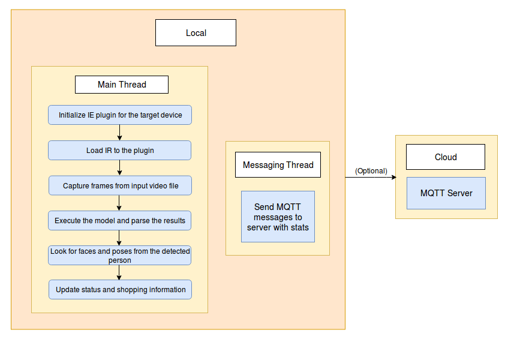

# Shopper Gaze Monitor

| Details               |              |
|-----------------------|---------------|
| Target OS:            |  Ubuntu\* 16.04 LTS   |
| Programming Language: |  Python* 3.5 |
| Time to Complete:     |  30 min     |

This reference implementation is also [available in C++](https://github.com/intel-iot-devkit/reference-implementation-private/blob/master/shopper-gaze-monitor/README.md).


## Introduction

This shopper gaze monitor application uses the Inference Engine included in the Intel® Distribution of OpenVINO™ toolkit and the Intel® Deep Learning Deployment Toolkit. It is designed for a retail shelf mounted camera system that counts the number of passers-by that look towards the display vs. the number of people that pass by the display without looking. 

It is intended to provide real-world marketing statistics for in-store shelf-space advertising.

## How it works

The application uses a video source, such as a camera, to grab frames and then uses two different Deep Neural Networks (DNNs) to process the data. The first network looks for faces and then if successful is counted as a "Shopper" 

A second neural network is then used to determine the head pose detection for each detected face. If the person's head is facing towards the camera, it is counted as a "Looker"

The shopper and looker data are sent to a local web server using the Paho* MQTT C client libraries.

The DNN model used in this application is an Intel® optimized model that is part of the Intel® Distribution of OpenVINO™ toolkit. You can find it here:

  * /opt/intel/computer_vision_sdk/deployment_tools/intel_models/face-detection-adas-0001
  * /opt/intel/computer_vision_sdk/deployment_tools/intel_models/head-pose-estimation-adas-0001



The program creates two threads for concurrency:

 * Main thread that performs the video i/o, processes video frames using the trained neural network.
 * Worker thread that publishes MQTT messages.
	
		
## Requirements

### Hardware

* 6th to 8th generation Intel® Core™ processor with Iris® Pro graphics or Intel® HD Graphics

### Software

* Ubuntu 16.04

* OpenCL™ Runtime Package

  **Note:** We recommend using a 4.14+ kernel to use this software. Run the following command to determine your kernel version:

	```uname -a```
  
* Intel® Distribution of OpenVINO™ toolkit 2018 R5 release

## Setup

### Install Intel® Distribution of OpenVINO™ toolkit

Refer to https://software.intel.com/en-us/articles/OpenVINO-Install-Linux for more information about how to install and setup the Intel® Distribution of OpenVINO™ toolkit.

You will need the OpenCL™ Runtime package if you plan to run inference on the GPU. It is not mandatory for CPU inference.

### Install Python* dependencies

```sudo apt install python3-pip```

```sudo apt-get install mosquitto mosquitto-clients```

```pip3 install jupyter ```

```pip3 install numpy```

```pip3 install paho-mqtt```

## Setting the Build Environment

You must configure the environment to use the Intel® Distribution of OpenVINO™ toolkit one time per session by running the following command:

 ```source /opt/intel/computer_vision_sdk/bin/setupvars.sh -pyver 3.5```
	

## Run the application

Go to `shopper-gaze-monitor-python` directory:

```cd <path-to-shopper-gaze-monitor-python-directory>```

To see a list of the various options:

```python3 main.py --help```

### Sample Video

You can download sample video by running following commands.	

```
mkdir resources
cd resources
wget https://github.com/intel-iot-devkit/sample-videos/raw/master/face-demographics-walking-and-pause.mp4 
wget https://github.com/intel-iot-devkit/sample-videos/raw/master/face-demographics-walking.mp4 
wget https://github.com/intel-iot-devkit/sample-videos/blob/master/head-pose-face-detection-female.mp4 	
cd .. 
```


### Running on the CPU

When running Intel® Distribution of OpenVINO™ toolkit Python applications on the CPU, the CPU extension library is required. This can be found at 
```/opt/intel/computer_vision_sdk/deployment_tools/inference_engine/lib/ubuntu_16.04/intel64/``` after building the Intel® Distribution of OpenVINO™ toolkit examples.

Though by default the application runs on CPU, this can also be explicitly specified by -d CPU command-line argument:

	python3 main.py -m /opt/intel/computer_vision_sdk/deployment_tools/intel_models/face-detection-adas-0001/FP32/face-detection-adas-0001.xml -pm /opt/intel/computer_vision_sdk/deployment_tools/intel_models/head-pose-estimation-adas-0001/FP32/head-pose-estimation-adas-0001.xml -l /opt/intel/computer_vision_sdk/inference_engine/lib/ubuntu_16.04/intel64/libcpu_extension_sse4.so -d CPU -i resources/face-demographics-walking-and-pause.mp4

**Note**: To get the input video from the camera, use -i cam command-line argument. For example:

	python3 main.py -m /opt/intel/computer_vision_sdk/deployment_tools/intel_models/face-detection-adas-0001/FP32/face-detection-adas-0001.xml -pm /opt/intel/computer_vision_sdk/deployment_tools/intel_models/head-pose-estimation-adas-0001/FP32/head-pose-estimation-adas-0001.xml -l /opt/intel/computer_vision_sdk/inference_engine/lib/ubuntu_16.04/intel64/libcpu_extension_sse4.so -i cam


### Running on the GPU

To run on the integrated Intel® GPU in 32 bit mode, use the -d GPU command-line argument:

	python3 main.py -m /opt/intel/computer_vision_sdk/deployment_tools/intel_models/face-detection-adas-0001/FP32/face-detection-adas-0001.xml -pm /opt/intel/computer_vision_sdk/deployment_tools/intel_models/head-pose-estimation-adas-0001/FP32/head-pose-estimation-adas-0001.xml -i resources/face-demographics-walking-and-pause.mp4 -d GPU

To use GPU in 16 bit mode, use the following command:

	python3 main.py -m /opt/intel/computer_vision_sdk/deployment_tools/intel_models/face-detection-adas-0001/FP16/face-detection-adas-0001.xml -pm /opt/intel/computer_vision_sdk/deployment_tools/intel_models/head-pose-estimation-adas-0001/FP16/head-pose-estimation-adas-0001.xml -i resources/face-demographics-walking-and-pause.mp4 -d GPU

**Note**: To get the input video from the camera, use -i cam command-line argument. For example:

	python3 main.py -m /opt/intel/computer_vision_sdk/deployment_tools/intel_models/face-detection-adas-0001/FP32/face-detection-adas-0001.xml -pm /opt/intel/computer_vision_sdk/deployment_tools/intel_models/head-pose-estimation-adas-0001/FP32/head-pose-estimation-adas-0001.xml -i cam -d GPU


### Running on the Intel® Neural Compute Stick
To run on the Intel® Neural Compute Stick, use the ```-d MYRIAD``` command-line argument:
```
python3 main.py -d MYRIAD -m /opt/intel/computer_vision_sdk/deployment_tools/intel_models/face-detection-adas-0001/FP16/face-detection-adas-0001.xml -pm /opt/intel/computer_vision_sdk/deployment_tools/intel_models/head-pose-estimation-adas-0001/FP16/head-pose-estimation-adas-0001.xml -i resources/face-demographics-walking-and-pause.mp4
```
**Note:** The Intel® Neural Compute Stick can only run FP16 models. The model that is passed to the application, through the `-m <path_to_model>` command-line argument, must be of data type FP16.
  

# Machine to machine messaging with MQTT

If you wish to use a MQTT server to publish data, you should set the following environment variables on the terminal before running the program.
 
   ```export MQTT_SERVER=localhost:1883```
 
   ```export MQTT_CLIENT_ID=cvservice```

Change the MQTT_SERVER to a value that matches the MQTT server you are connecting to.

You should change the MQTT_CLIENT_ID to a unique value for each monitoring station, so you can track the data for individual locations. For example:

   ```export MQTT_CLIENT_ID=zone1337```

If you want to monitor the MQTT messages sent to your local server, and you have the mosquitto client utilities installed, you can run the following command in new terminal while executing the code:

   ```mosquitto_sub -h localhost -t shopper_gaze_monitor```
