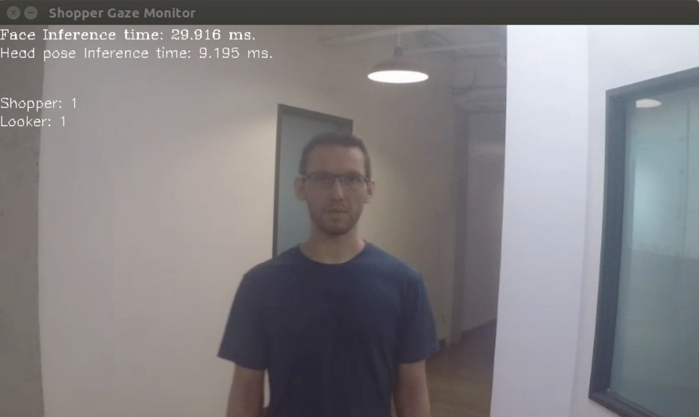
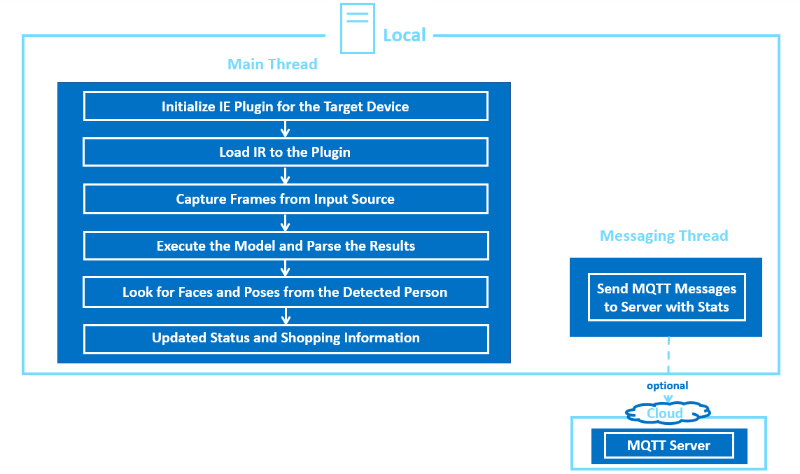

# Shopper Gaze Monitor

| Details               |              |
|-----------------------|---------------|
| Target OS:            |  Ubuntu\* 18.04 LTS   |
| Programming Language: |  Python* 3.5 |
| Time to Complete:     |  30 min     |

<!--
This reference implementation is also [available in C++](https://github.com/intel-iot-devkit/reference-implementation-private/blob/master/shopper-gaze-monitor/README.md).
-->


## What it does

This shopper gaze monitor application is designed for a retail shelf mounted camera system that counts the number of passers-by and the number of people who look towards the display. It is intended to provide real-world marketing statistics for in-store shelf-space advertising.

## Requirements
### Hardware

* 6th to 8th generation Intel® Core™ processor with Iris® Pro graphics or Intel® HD Graphics

### Software

* Ubuntu 18.04

* OpenCL™ Runtime Package

  **Note:** We recommend using a 4.14+ kernel to use this software. Run the following command to determine your kernel version:

      uname -a
  
* Intel® Distribution of OpenVINO™ toolkit 2020 R3 Release

## How It works

The application uses the Inference Engine included in the Intel Distribution of OpenVINO toolkit and the Intel Deep Learning Deployment Toolkit. It uses a video source, such as a camera, to grab frames and then uses two different Deep Neural Networks (DNNs) to process the data. The first network looks for faces and then if successful is counted as a "Shopper" 

A second neural network is then used to determine the head pose detection for each detected face. If the person's head is facing towards the camera, it is counted as a "Looker"

The shopper and looker data are sent to a local web server using the Paho* MQTT C client libraries.

The program creates two threads for concurrency:

 * Main thread that performs the video i/o, processes video frames using the trained neural network.
 * Worker thread that publishes MQTT messages.



**Architectural Diagram**

## Setup
### Get the code

Clone the reference implementation:
```
sudo apt-get update && sudo apt-get install git
git clone https://github.com/intel-iot-devkit/shopper-gaze-monitor-python.git 
``` 

### Install Intel® Distribution of OpenVINO™ toolkit

Refer to https://software.intel.com/en-us/articles/OpenVINO-Install-Linux for more information about how to install and setup the Intel® Distribution of OpenVINO™ toolkit.

You will need the OpenCL™ Runtime package if you plan to run inference on the GPU. It is not mandatory for CPU inference. 

### Other dependencies
#### Mosquitto*
Mosquitto is an open source message broker that implements the MQTT protocol. The MQTT protocol provides a lightweight method of carrying out messaging using a publish/subscribe model.

### Which model to use

This application uses the [face-detection-adas-0001](https://docs.openvinotoolkit.org/2020.3/_models_intel_face_detection_adas_0001_description_face_detection_adas_0001.html) and [head-pose-estimation-adas-0001](https://docs.openvinotoolkit.org/2020.3/_models_intel_human_pose_estimation_0001_description_human_pose_estimation_0001.html) Intel® model, that can be downloaded using the **model downloader**. The **model downloader** downloads the __.xml__ and __.bin__ files that is used by the application. 

To install the dependencies of the RI and to download the models Intel® model, run the following command:

    cd <path_to_the_shopper-gaze-monitor-python_directory>
    ./setup.sh 
    
The models will be downloaded inside the following directories:

    /opt/intel/openvino/deployment_tools/open_model_zoo/tools/downloader/intel/face-detection-adas-0001/     
    /opt/intel/openvino/deployment_tools/open_model_zoo/tools/downloader/intel/head-pose-estimation-adas-0001/ 

### The Config File

The _resources/config.json_ contains the path to the videos that will be used by the application.
The _config.json_ file is of the form name/value pair, `video: <path/to/video>`   

Example of the _config.json_ file:

```
{

    "inputs": [
	    {
            "video": "videos/video1.mp4"
        }
    ]
}
```

### Which Input video to use

The application works with any input video. Find sample videos [here](https://github.com/intel-iot-devkit/sample-videos/).  

For first-use, we recommend using the [face-demographics-walking-and-pause](https://github.com/intel-iot-devkit/sample-videos/blob/master/face-demographics-walking-and-pause.mp4) video.The video is automatically downloaded to the `resources/` folder.
For example: <br>
The config.json would be:

```
{

    "inputs": [
	    {
            "video": "sample-videos/face-demographics-walking-and-pause.mp4"
        }
    ]
}
```
To use any other video, specify the path in config.json file

### Using the Camera instead of video

Replace the path/to/video in the _resources/config.json_  file with the camera ID, where the ID is taken from the video device (the number X in /dev/videoX).   

For example:

```
{

    "inputs": [
	    {
            "video": "0"
        }
    ]
}
```

On Ubuntu, list all available video devices with the following command:

```
ls /dev/video*
```

## Setup the environment
You must configure the environment to use the Intel® Distribution of OpenVINO™ toolkit one time per session by running the following command:

    source /opt/intel/openvino/bin/setupvars.sh
    
__Note__: This command needs to be executed only once in the terminal where the application will be executed. If the terminal is closed, the command needs to be executed again.

## Run the application

Change the current directory to the git-cloned application code location on your system:
    
    cd <path_to_shopper-gaze-monitor-python_directory>/application
    
To see a list of the various options:

    python3 shopper_gaze_monitor.py --help

A user can specify a target device to run on by using the device command-line argument `-d` followed by one of the values `CPU`, `GPU`,`MYRIAD`, `HDDL` or `HETERO:FPGA,CPU`.<br>
To run with multiple devices use -d MULTI:device1,device2. For example: `-d MULTI:CPU,GPU,MYRIAD`

### Running on the CPU

Though by default the application runs on CPU, this can also be explicitly specified by ```-d CPU``` command-line argument:

	python3 shopper_gaze_monitor.py -m /opt/intel/openvino/deployment_tools/open_model_zoo/tools/downloader/intel/face-detection-adas-0001/FP32/face-detection-adas-0001.xml -pm /opt/intel/openvino/deployment_tools/open_model_zoo/tools/downloader/intel/head-pose-estimation-adas-0001/FP32/head-pose-estimation-adas-0001.xml -d CPU

### Running on the GPU

* To run on the integrated Intel® GPU with floating point precision 32 (FP32), use the `-d GPU` command-line argument:

      python3 shopper_gaze_monitor.py -m /opt/intel/openvino/deployment_tools/open_model_zoo/tools/downloader/intel/face-detection-adas-0001/FP32/face-detection-adas-0001.xml -pm /opt/intel/openvino/deployment_tools/open_model_zoo/tools/downloader/intel/head-pose-estimation-adas-0001/FP32/head-pose-estimation-adas-0001.xml -d GPU
   
   **FP32**: FP32 is single-precision floating-point arithmetic uses 32 bits to represent numbers. 8 bits for the magnitude and 23 bits for the precision. For more information, [click here](https://en.wikipedia.org/wiki/Single-precision_floating-point_format)<br>

* To run on the integrated Intel® GPU with floating point precision 16 (FP16):

      python3 shopper_gaze_monitor.py -m /opt/intel/openvino/deployment_tools/open_model_zoo/tools/downloader/intel/face-detection-adas-0001/FP16/face-detection-adas-0001.xml -pm /opt/intel/openvino/deployment_tools/open_model_zoo/tools/downloader/intel/head-pose-estimation-adas-0001/FP16/head-pose-estimation-adas-0001.xml -d GPU
   
   **FP16**: FP16 is half-precision floating-point arithmetic uses 16 bits. 5 bits for the magnitude and 10 bits for the precision. For more information, [click here](https://en.wikipedia.org/wiki/Half-precision_floating-point_format)

### Running on the Intel® Neural Compute Stick
To run on the Intel® Neural Compute Stick, use the ```-d MYRIAD``` command-line argument:

    python3 shopper_gaze_monitor.py -d MYRIAD -m /opt/intel/openvino/deployment_tools/open_model_zoo/tools/downloader/intel/face-detection-adas-0001/FP16/face-detection-adas-0001.xml -pm /opt/intel/openvino/deployment_tools/open_model_zoo/tools/downloader/intel/head-pose-estimation-adas-0001/FP16/head-pose-estimation-adas-0001.xml

**Note:** The Intel® Neural Compute Stick can only run FP16 models. The model that is passed to the application, through the `-m <path_to_model>` command-line argument, must be of data type FP16.

### Running on the Intel® Movidius™ VPU
To run on the Intel® Movidius™ VPU, use the ```-d HDDL``` command-line argument:

    python3 shopper_gaze_monitor.py -m /opt/intel/openvino/deployment_tools/open_model_zoo/tools/downloader/intel/face-detection-adas-0001/FP16/face-detection-adas-0001.xml -pm /opt/intel/openvino/deployment_tools/open_model_zoo/tools/downloader/intel/head-pose-estimation-adas-0001/FP16/head-pose-estimation-adas-0001.xml -d HDDL

**Note:** The Intel® Movidius™ VPU can only run FP16 models. The model that is passed to the application, through the `-m <path_to_model>` command-line argument, must be of data type FP16.

# Machine to machine messaging with MQTT

If you wish to use a MQTT server to publish data, you should set the following environment variables on the terminal before running the program.
 
    export MQTT_SERVER=localhost:1883
    export MQTT_CLIENT_ID=cvservice

Change the MQTT_SERVER to a value that matches the MQTT server you are connecting to.

You should change the MQTT_CLIENT_ID to a unique value for each monitoring station, so you can track the data for individual locations. For example:

    export MQTT_CLIENT_ID=zone1337

If you want to monitor the MQTT messages sent to your local server, and you have the mosquitto client utilities installed, you can run the following command in new terminal while executing the code:

    mosquitto_sub -h localhost -t shopper_gaze_monitor
